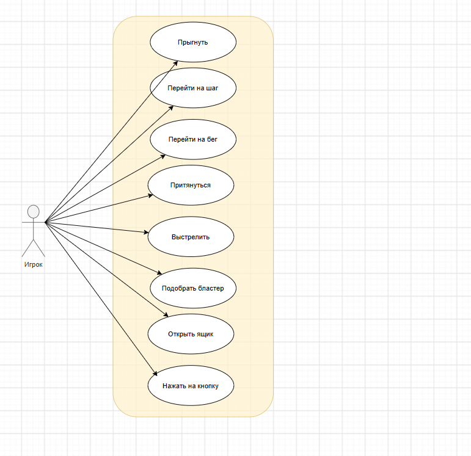
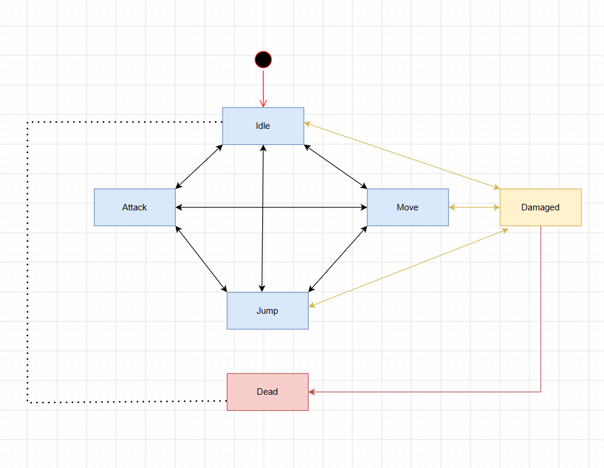
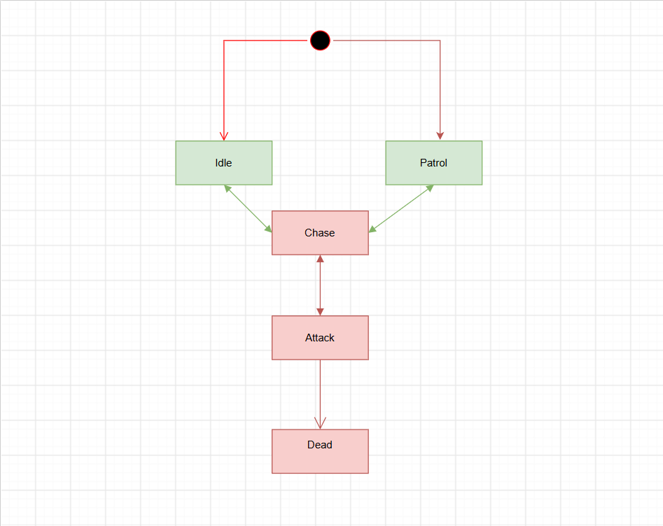

# Kernel

> Приключенческий экшен от третьего лица с элементами паркура, головоломок и шутера.
> Робот-антивирус пробирается через заражённое ядро системы, чтобы освободить союзника.

---

## Содержание

- [1. Общее описание системы](#1-общее-описание-системы)
- [2. Игровая концепция и геймдизайн](#2-игровая-концепция-и-геймдизайн)
- [3. Функциональные требования](#3-функциональные-требования)
- [4. Игровые сущности и модель данных](#4-игровые-сущности-и-модель-данных)
- [5. Состояния и жизненные циклы](#5-состояния-и-жизненные-циклы)
- [6. Уровни и прогрессия](#6-уровни-и-прогрессия)
- [7. Архитектура системы](#7-архитектура-системы)
- [8. Пользовательский интерфейс](#8-пользовательский-интерфейс)
- [9. Нефункциональные требования](#9-нефункциональные-требования)
- [10. Глоссарий](#10-глоссарий)

---

## 1. Общее описание системы

### 1.1. Назначение системы

| Параметр | Значение |
|---|---|
| Название | Kernel |
| Жанр | Приключенческий экшен с элементами паркура, головоломок и шутера |
| Камера | От третьего лица |
| Режим | Одиночный, полностью оффлайн |
| Количество разработчиков | 3 |
| Ориентировочная продолжительность | 30–50 минут |

### 1.2. Целевая аудитория

Игроки 12–25 лет, знакомые с 3D-платформерами и шутерами от третьего лица.

### 1.3. Цели проекта

| ID | Цель |
|---|---|
| **Ц-1** | Реализовать связку паркур-перемещения и стрелкового боя как основную игровую механику |
| **Ц-2** | Обеспечить прохождение сюжетной кампании от старта до победы над боссом |
| **Ц-3** | Обеспечить полностью автономную работу без внешних сервисов |
| **Ц-4** | Обеспечить стабильную работу на целевой платформе (ПК) |

### 1.4. Технологический стек

| Компонент | Технология |
|---|---|
| Игровой движок | Unity |
| Язык программирования | C# |
| Целевая платформа | Windows |
| Хранение данных | Локальная файловая система |

---

## 2. Игровая концепция и геймдизайн

### 2.1. Описание концепции

Игрок управляет роботом-антивирусом, который существует внутри заражённой системы. Робот пробирается через заражённое ядро; его цель — освободить союзника, похищенного вирусом-боссом.

**Испытания на пути игрока:**

- Паркур по разрушенным платформам
- Обнаружение ловушек
- Логическая головоломка с уравнениями
- Головоломка с подъёмом на уровень выше
- Стрельба по вирусам
- Сбор шестерёнок
- Поиск ключей-доступов
- Финальный бой с пауком — главным врагом

**Снаряжение робота:**

| Предмет | Назначение |
|---|---|
| Магнитные перчатки | Перемещение за счёт притягивания к железным платформам |
| Бластер | Сражение с врагами |

После победы над боссом игрок освобождает союзника, заражённая система начинает очищаться. Игра считается пройденной.

### 2.2. Ключевые механики

| ID | Механика | Описание |
|---|---|---|
| **М-1** | Перемещение | Ходьба, бег, поворот камеры, притягивание |
| **М-2** | Паркур | Прыжок, двойной прыжок |
| **М-3** | Стрельба | Дистанционная атака по противникам |
| **М-4** | Получение урона | Снижение запаса прочности игрока при попадании по нему врагами |

### 2.3. Условия победы и поражения

| Исход | Условие |
|---|---|
| 🏆 **Победа** | Босс уничтожен, союзник освобождён, воспроизведён финальный экран |
| 💀 **Поражение** | Запас здоровья игрока достиг нуля. Игрок возвращается к началу игры; прогресс уровня сбрасывается полностью |

---

## 3. Функциональные требования

### 3.1. Акторы

  
  
<i>Диаграмма вариантов использования</i>

### 3.2. Перечень вариантов использования

| ID | Вариант использования |
|---|---|
| **UC-01** | Прыгнуть |
| **UC-02** | Перейти на шаг |
| **UC-03** | Перейти на бег |
| **UC-04** | Притянуться |
| **UC-05** | Выстрелить |
| **UC-06** | Подобрать |
| **UC-07** | Открыть ящик |
| **UC-08** | Нажать на кнопку |

### 3.3. Детализация ключевых вариантов использования

<b>UC-05. Выстрелить по противнику</b>

**Основной сценарий:**

1. Система проверяет наличие бластера.
2. Система создаёт снаряд в точке ствола оружия по направлению прицеливания.
3. Система воспроизводит звук выстрела и визуальный эффект.
4. Снаряд перемещается до столкновения с коллайдером.
5. При попадании в противника система вычисляет урон и уменьшает прочность противника.
6. Если прочность противника достигла нуля — система инициирует сценарий уничтожения противника.

**Альтернативные потоки:**

| ID | Условие | Результат |
|---|---|---|
| **А2** | Попадание в объект окружения — на шаге 6 снаряд столкнулся с непроходимой геометрией | Урон не начисляется, снаряд уничтожается |
| **А3** | Промах — снаряд не столкнулся ни с чем в пределах максимальной дальности | Снаряд уничтожается по таймауту |

<b>UC-04. Притянуться</b>

**Основной сценарий:**

1. Игрок целится в объект «Металлическая пластина».
2. Система проверяет наличие объектов «Магнитная перчатка» и «Металлическая пластина» по заданному радиусу.
3. Система задаёт Ray Cast в центр металлической пластины.
4. Игрок притягивается по заданной траектории до столкновения с коллайдером металлической пластины.

---

## 4. Игровые сущности и модель данных

### 4.1. Персонаж игрока

| Атрибут | Тип | Описание |
|---|---|---|
| `health` | `int` | Текущий запас прочности |
| `maxHealth` | `int` | Максимальный запас прочности |
| `moveSpeed` | `float` | Скорость перемещения |
| `jumpForce` | `float` | Сила прыжка |
| `jumpCount` | `int` | Использованные прыжки в текущем воздушном отрезке |
| `isGrounded` | `bool` | Признак контакта с поверхностью |
| `currentState` | `enum` | Текущее состояние конечного автомата |

### 4.2. Противники (вирусы)

Общий базовый тип с параметрами и специализациями.

| Атрибут | Тип | Описание |
|---|---|---|
| `health` | `int` | Запас прочности |
| `damage` | `int` | Урон, наносимый игроку |
| `detectionRadius` | `float` | Радиус обнаружения игрока |
| `attackRadius` | `float` | Дистанция перехода к атаке |
| `moveSpeed` | `float` | Скорость перемещения |

### 4.3. Объекты уровня

| Объект | Назначение |
|---|---|
| Платформа | Опорная поверхность для паркура; может быть статической или подвижной |
| Препятствие / ловушка | Наносит урон или блокирует проход |
| Триггер перехода | Инициирует завершение уровня или активацию сцены |
| Союзник | Целевой объект финального уровня |

---

## 5. Состояния и жизненные циклы

### 5.1. Состояния персонажа игрока

| Состояние | Описание | Переходы |
|---|---|---|
| `Idle` | Персонаж стоит на поверхности | → `Move`, `Jump`, `Attack`, `Damaged` |
| `Move` | Персонаж перемещается | → `Idle`, `Jump`, `Attack`, `Damaged` |
| `Jump` | Персонаж в воздухе | → `Idle`, `Move`, `Attack`, `Damaged` |
| `Attack` | Выполняется выстрел | → `Idle`, `Move`, `Jump` |
| `Damaged` | Получен урон, действует период неуязвимости | → `Idle`, `Dead` |
| `Dead` | Прочность исчерпана | → возрождение в начале игры |

  
  
<i>Конечный автомат персонажа игрока</i>

### 5.2. Состояния противника

| Состояние | Описание | Условие перехода |
|---|---|---|
| `Idle` | Ожидание | Игрок вне радиуса обнаружения |
| `Patrol` | Патрулирование маршрута | Задан маршрут, игрок не обнаружен |
| `Chase` | Преследование игрока | Игрок в радиусе обнаружения |
| `Attack` | Атака | Игрок в радиусе атаки |
| `Dead` | Уничтожен | Прочность = 0 |

  
  
<i>Конечный автомат противника</i>

---

## 6. Уровни и прогрессия

### 6.1. Структура кампании

| № | Уровень | Описание |
|---|---|---|
| 1 | Паркур | Паркур над слизью, ловушки |
| 2 | Утерянный код | Головоломка: нужно собрать код, чтобы открыть дверь |
| 3 | Лабиринт | Часть кода от двери находится в лабиринте |
| 4 | Паркур | За дверью паркур над слизью |
| 5 | Пирамида | Нужно двигать массивные блоки, чтобы подняться на второй этаж |
| 6 | Бой | Столкновение с противниками |
| 7 | Паркур | Паркур для подъёма на третий этаж |
| 8 | Шестерёнки | Головоломка: нужно найти 7 шестерёнок, чтобы открылась финальная дверь |
| 9 | Финальный бой | Бой с боссом |
| 10 | Освобождение | Открытие клетки с союзником, заставка |

### 6.2. Правила прогрессии

| ID | Правило |
|---|---|
| **ПР-1** | Уровни проходятся строго последовательно; пропуск невозможен |
| **ПР-2** | Следующий уровень открывается после активации триггера завершения предыдущего |
| **ПР-3** | Внутри уровня не расположены контрольные точки; при гибели игрок возрождается в начале игры |
| **ПР-4** | При возрождении противники в пределах текущего сегмента уровня восстанавливаются |

---

## 7. Архитектура системы

### 7.1. Состав модулей

| Модуль | Зона ответственности |
|---|---|
| `GameManager` | Глобальное состояние игры, переключение режимов, обработка победы и поражения |
| `InputHandler` | Приём и нормализация пользовательского ввода |
| `PlayerController` | Перемещение, паркур, конечный автомат персонажа |
| `CombatSystem` | Расчёт урона |
| `EnemyAI` | Поведенческая логика противников, поиск и преследование цели |
| `AudioManager` | Воспроизведение звуковых эффектов и музыки |

### 7.2. Принципы взаимодействия

| ID | Принцип |
|---|---|
| **А-1** | Модули взаимодействуют преимущественно через событийную систему; прямые ссылки между несвязанными модулями не допускаются |
| **А-2** | `GameManager` является единой точкой управления глобальным состоянием; изменение состояния из других модулей выполняется только через его публичный интерфейс |

---

## 8. Пользовательский интерфейс

### 8.1. Перечень экранов

| Экран | Содержимое |
|---|---|
| HUD | Индикатор прочности, прицел, инвентарь |
| Экран победы | Финальное сообщение |
| Экран поражения | Сообщение о гибели, «Возродиться» |

### 8.2. Требования к интерфейсу

| ID | Требование |
|---|---|
| **UI-1** | HUD отображается только в состоянии `Playing` |
| **UI-2** | Индикатор прочности обновляется немедленно при изменении значения |

---

## 9. Нефункциональные требования

### 9.1. Производительность

| ID | Требование |
|---|---|
| **НФТ-1** | Целевая частота кадров — не ниже 60 FPS |
| **НФТ-2** | Задержка отклика на ввод — не более 50 мс |

### 9.2. Автономность

| ID | Требование |
|---|---|
| **НФТ-3** | Приложение полностью функционально без подключения к сети |
| **НФТ-4** | Данные хранятся исключительно в локальной файловой системе |
| **НФТ-5** | Персональные данные пользователя не собираются и не передаются |

### 9.3. Управление

| ID | Требование |
|---|---|
| **НФТ-6** | Поддерживается управление с клавиатуры и мыши |
| **НФТ-7** | Все игровые действия доступны без использования дополнительных устройств |

### 9.4. Требования к среде исполнения

| Параметр | Минимальное значение |
|---|---|
| ОС | Windows 10 |
| Оперативная память | 4 ГБ |
| Свободное место на диске | 1 ГБ |

### 9.5. Баланс

| ID | Требование |
|---|---|
| **НФТ-8** | Ориентировочное время полного прохождения — 30–50 минут |
| **НФТ-9** | Любой участок уровня проходим без потери прочности при корректных действиях игрока |

---

## 10. Глоссарий

| Термин | Определение |
|---|---|
| **Прочность** (`health`) | Числовой параметр, определяющий, сколько урона может выдержать сущность до уничтожения |
| **Паркур** | Совокупность механик преодоления препятствий за счёт прыжков и перемещения по элементам геометрии уровня |
| **Вирус** (враг, противник) | Общее обозначение враждебных сущностей в игре |
| **Союзник** | Дружественная программа, освобождение которой является целью кампании |
| **HUD** | Внутриигровой интерфейс, отображаемый поверх игровой сцены во время игрового процесса |
| **Триггер** | Область на уровне, вход в которую инициирует игровое событие |
